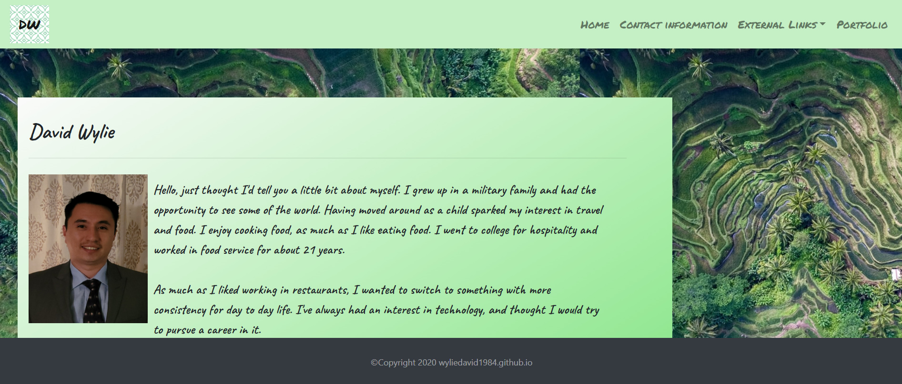
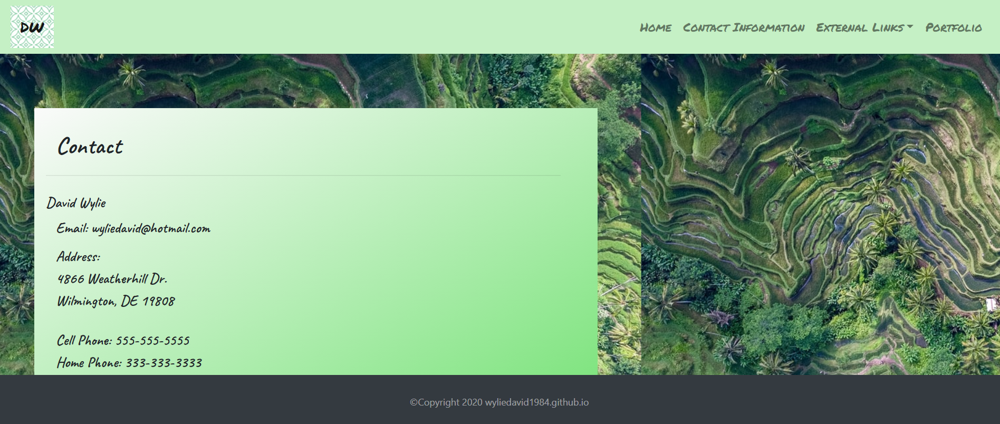
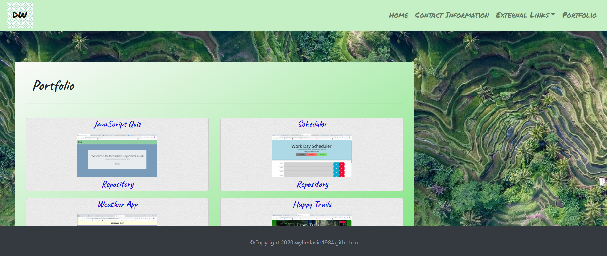
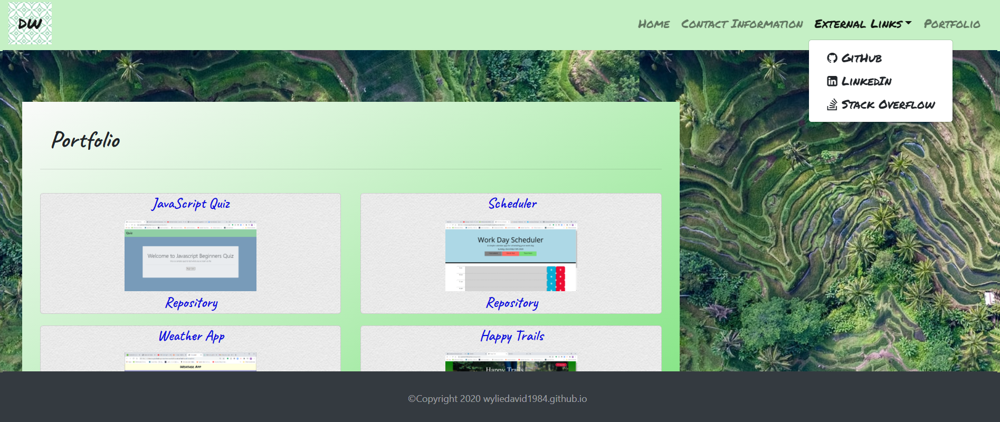

# Portfolio

## Description

This a responsive portfolio that has three separate html pages. In the navbar, I just used my initials as a logo. The navbar also connects all three html pages.  I've also include a dropdown that contain my linkedIn, github, and Stack Overflow pages.  The contact page has all the contact info, as well as a resume in pdf format.  The portfolio includes several projects that I have worked on over the course of my boot camp.  They are listed in chronological order.  I kept it like that to show the progression of my work over a span of a month. 

## Technologies

### HTML

I used HTML5 to put together several html pages. There are multiple tags through out. I've used semantic tags in hopes to make the pages be as correct as possible. 

### CSS

I used CSS3 to add a little styling to the page. I also used css to add in background images. I also used Bootstrap to help with the responsiveness of the page. 

## Screen Shots

Shots of the deploy portfolio

#### Home Page

#### Contact Page

#### Portfolio Page

#### Dropdown Menu with External Links

## Links

* [Deployed Portfolio](https://wyliedavid1984.github.io/)
* [Github repository](https://github.com/wyliedavid1984/wyliedavid1984.github.io)

## Credits

* [W3schools CSS](https://www.w3schools.com/css)
* [Bootstrap](https://getbootstrap.com/)
* [Background Styling](https://unsplash.com/backgrounds)
* [Toptal for Backgrounds](https://www.toptal.com/designers/subtlepatterns/)
* [Font Awesome icons](https://fontawesome.com/)